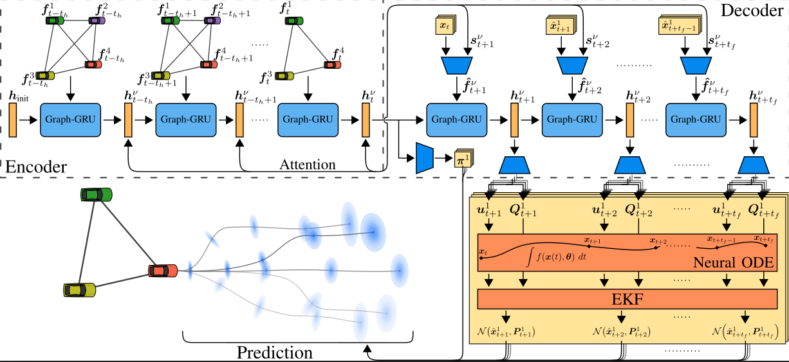

# MTP-GO: Graph-Based Probabilistic Multi-Agent Trajectory Prediction with Neural ODEs
> _mtp-go_ is a library containing the implementation for the paper: 
> **MTP-GO: Graph-Based Probabilistic Multi-Agent Trajectory Prediction with Neural ODEs**
> The paper is currectly available in preprint format on ArXiv and can be accessed [here](https://arxiv.org/abs/2302.00735).
> All code is written using Python 3 using a combination of [PyTorch](https://pytorch.org/), [PyTorch Geometric](https://pytorch-geometric.readthedocs.io/en/latest/) and [PyTorch Lightning](https://pytorch-lightning.readthedocs.io/en/latest/).
> Planned contents of this repository will be added incrementally and is underway.


##### If you found the content of this repository useful, please consider citing the paper in your work:
```
@article{westny2023graph,
	title="{MTP-GO: G}raph-Based Probabilistic Multi-Agent Trajectory Prediction with Neural {ODE}s",
	author={Westny, Theodor and Oskarsson, Joel and Olofsson, Bj{\"o}rn and Frisk, Erik},
	journal={arXiv preprint arXiv:2302.00735},
	year={2023}}
```
***

#### Hardware requirements

The original implementation make use of a considerable amount of data (some gigabytes worth) for training and testing which can be demanding for some setups. For you reference all code has been tried and used on a computer with the following specs:
```
* Processor: Intel® Xeon(R) E-2144G CPU @ 3.60GHz x 8
* Memory: 32 GB
* GPU: NVIDIA Corporation TU102 [GeForce RTX 2080 Ti Rev. A]
```

## Usage

UNDER UPDATE



## Data sets

For model training and evaluation, the [highD](https://www.highd-dataset.com/), [rounD](https://www.round-dataset.com/), and [inD](https://www.ind-dataset.com/) were used.
They are freely available fron non-commercial use, but does require that you apply through the links above.

## Data extraction 

UNDER UPDATE

## License
[Creative Commons](https://creativecommons.org/licenses/by-sa/4.0/)

## Inquiries
> Questions about the paper or the implementations found in this repository should be sent to [_theodor.westny [at] liu.se_](https://liu.se/en/employee/thewe60).
